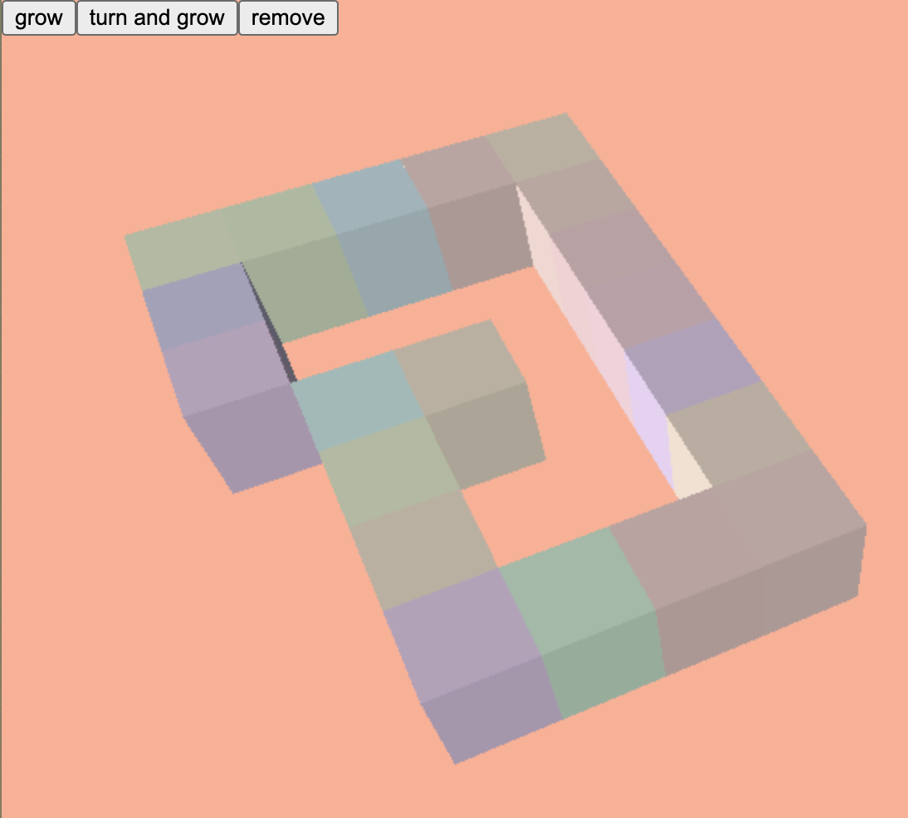

# fp.sectional-planner

Experimenting with basic boxes to build a sectional planner.



## how to install
```bash
bun install
```

## develop:
```bash
npm run dev
```
which in turn basically just runs:
```bash
bun build ./main.js --outdir ./out --watch
```
 For serving it up I used
```bash
    npx serve
```
